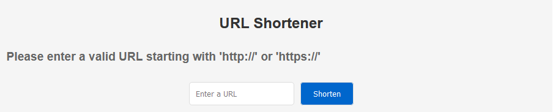

## urlshort
<p align="center">
 
</p>

My solutions to https://github.com/gophercises/urlshort

This application is designed as an URL shortener. It operates by either accepting a JSON or YAML file that contains mappings between shortened URLs and their actual destinations, or by utilizing an external storage system to store these mappings.

The application makes use of the package [urlshort](./handler.go) located in this same repository.

To run the application by accepting JSON or YAML files, the following functions are used:

- [func JSONHandler\(data \[\]byte, fallback http.Handler\) \(http.HandlerFunc, error\)](package_docs.md#func-jsonhandler)
- [func YAMLHandler\(yml \[\]byte, fallback http.Handler\) \(http.HandlerFunc, error\)](package_docs.md#func-yamlhandler)
- [func MapHandler\(pathsToUrls map\[string\]string, fallback http.Handler\) http.HandlerFunc](package_docs.md#func-maphandler)

To run the application by utilizing an external storage system, the following functions are used:
- [func Shortener\(saver UrlShortSaver, host string, fallback http.Handler\) http.HandlerFunc](package_docs.md#func-shortener)
- [func RetrieveHandler\(getter UrlShortGetter, fallback http.Handler\) http.HandlerFunc](package_docs.md#func-retrievehandler)
- [func ShortenerHome\(w http.ResponseWriter, r \*http.Request\)](package_docs.md#func-shortenerhome)
- [func MissingUrlHandler\(w http.ResponseWriter, r \*http.Request\)](package_docs.md#func-missingurlhandler)
- [func InvalidUrlHandler\(w http.ResponseWriter, r \*http.Request\)](package_docs.md#func-invalidurlhandler)

Any external storage service can be used and it must implement the following interfaces:

- [type UrlShortGetter](package_docs.md#type-urlshortgetter)
- [type UrlShortSaver](package_docs.md#type-urlshortsaver)

## Index
- [Usage](#usage)
    - [File-Based Configuration](#file-based-configuration)
        - [JSON File Structure](#json-file-structure)
        - [YAML File Structure](#yaml-file-structure)
        - [Running the Server](#running-the-server)
    - [Redis](#redis)
    - [Dockerized Application](#dockerized-application)
- [Tests](#tests)
    - [Unit Tests](#unit-tests)
    - [Integration Tests](#integration-tests)
- [Package Documentation](./package_docs.md)
- [Github Actions](#github-actions)

### Usage
This section provides instructions on how to operate the application locally under various conditions. The following software is required on your machine:

- [Golang 1.21.3 (or newer)](https://go.dev/doc/install)
- [Docker](https://www.docker.com/)

#### File-Based Configuration
The application supports operation via a JSON or YAML file that encapsulates mappings between shortened URLs and their corresponding destinations.

##### JSON File Structure
The JSON file must adhere to the following structure:

```json
[
    {
        "path": "/urlshort",
        "url": "https://github.com/gophercises/urlshort"
    },
    {
        "path": "/urlshort-final",
        "url": "https://github.com/gophercises/urlshort/tree/solution"
    }
]
```

A sample JSON file can be found at [json/paths.json](json/paths.json)

##### YAML File Structure
The YAML file should adhere to the following structure:

```yaml
- path: /urlshort
  url: https://github.com/gophercises/urlshort
- path: /urlshort-final
  url: https://github.com/gophercises/urlshort/tree/solution
```

A sample YAML file can be found at [yaml/paths.yml](yaml/paths.yml)

##### Running the Server

To start the server on port 8080, use the following command if the provided file is JSON:

```bash
go run cmd/file/main.go -json=$(JSON)
```

For instance:

```bash
go run cmd/file/main.go -json=json/paths.json
```

If the provided file is YAML, then run:

```bash
go run cmd/file/main.go -yaml=$(YAML)
```

For instance:

```bash
go run cmd/file/main.go -yaml=yaml/paths.yaml
```

You can customize the server port by executing: 

```bash
go run cmd/file/main.go -json=$(JSON) -yaml=$(YAML) -listen=$(PORT)
```

The server then will redirect requests according to the data provided in the file. Requests to `/urlshort` will be redirected to `https://github.com/gophercises/urlshort`, for instance.

#### Redis
The application also supports operation through an external storage service, where mappings between shortened URLs and their actual destinations can be stored. 

To operate the application using Redis as the external service, execute the following command:

```
make run_with_redis
```

This command will start the application at port 8080 and its associated Redis container at port 6379. Please ensure Docker is installed on your machine, as Redis runs as a Docker container

The following screen will appear at `/home`:



Shortened urls can then be generated and used.

To halt the application and its related Redis container, use the following command:

```
make stop_with_redis
```

### Tests

#### Unit Tests
Execute all configured unit tests by running the following command:

```
make unit_tests
```

#### Integration Tests
To execute both unit and integration tests, use the following command:

```
make integration_tests
```

Note that Docker is required to run integration tests. This is because the external storage, which is Redis running as a container, needs to be active during the tests

### Github Actions
CI/CD configured at [golang-setup.yml](.github/workflows/golang-setup.yml)