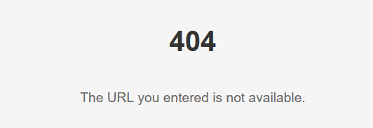

<!-- Code generated by gomarkdoc. DO NOT EDIT -->

# urlshort

```go
import "urlshort"
```

Package urlshort provides functions to implement a small server with urlshortener functionalities

## Index

- [Variables](<#variables>)
- [func InvalidUrlHandler\(w http.ResponseWriter, r \*http.Request\)](<#func-invalidurlhandler>)
- [func JSONHandler\(data \[\]byte, fallback http.Handler\) \(http.HandlerFunc, error\)](<#func-jsonhandler>)
- [func MapHandler\(pathsToUrls map\[string\]string, fallback http.Handler\) http.HandlerFunc](<#func-maphandler>)
- [func MissingUrlHandler\(w http.ResponseWriter, r \*http.Request\)](<#func-missingurlhandler>)
- [func RetrieveHandler\(getter UrlShortGetter, fallback http.Handler\) http.HandlerFunc](<#func-retrievehandler>)
- [func Shortener\(saver UrlShortSaver, host string, fallback http.Handler\) http.HandlerFunc](<#func-shortener>)
- [func ShortenerHome\(w http.ResponseWriter, r \*http.Request\)](<#func-shortenerhome>)
- [func YAMLHandler\(yml \[\]byte, fallback http.Handler\) \(http.HandlerFunc, error\)](<#func-yamlhandler>)
- [type UrlShortGetter](<#type-urlshortgetter>)
- [type UrlShortSaver](<#type-urlshortsaver>)


## Variables

<a name="ErrMissingKey"></a>

```go
var ErrMissingKey = errors.New("key not found")
```

<a name="InvalidUrlHandler"></a>
## func InvalidUrlHandler

```go
func InvalidUrlHandler(w http.ResponseWriter, r *http.Request)
```

InvalidUrlHandler returns page [html/error.html](html/error.html) when url not valid


<a name="JSONHandler"></a>
## func JSONHandler

```go
func JSONHandler(data []byte, fallback http.Handler) (http.HandlerFunc, error)
```

JSONHandler will parse the provided JSON and then return an http.HandlerFunc \(which also implements http.Handler\) that will attempt to map any paths to their corresponding URL. If the path is not provided in the YAML, then the fallback http.Handler will be called instead.

JSON is expected to be in the format:


```json
[
    {
        "path": "/urlshort",
        "url": "https://github.com/gophercises/urlshort"
    },
    {
        "path": "/urlshort-final",
        "url": "https://github.com/gophercises/urlshort/tree/solution"
    }
]
```

The only errors that can be returned all related to having invalid YAML data.

See MapHandler to create a similar http.HandlerFunc via a mapping of paths to urls.

<a name="MapHandler"></a>
## func MapHandler

```go
func MapHandler(pathsToUrls map[string]string, fallback http.Handler) http.HandlerFunc
```

MapHandler will return an http.HandlerFunc \(which also implements http.Handler\) that will attempt to map any paths \(keys in the map\) to their corresponding URL \(values that each key in the map points to, in string format\). If the path is not provided in the map, then the fallback http.Handler will be called instead.

<a name="MissingUrlHandler"></a>
## func MissingUrlHandler

```go
func MissingUrlHandler(w http.ResponseWriter, r *http.Request)
```

MissingUrlHandler returns page [html/fallback.html](html/fallback.html) when key not found



<a name="RetrieveHandler"></a>
## func RetrieveHandler

```go
func RetrieveHandler(getter UrlShortGetter, fallback http.Handler) http.HandlerFunc
```

RetrieveHandler will return an http.HandlerFunc \(which also implements http.Handler\) that will attempt to redirect any paths \(keys\) to their corresponding URL \(values that UrlShortGetter retrieves, in string format\). If the key is not found by getter, then the fallback http.Handler will be called instead. Handler must be attached to route /anypath/\{key\} or it won't work properly

<a name="Shortener"></a>
## func Shortener

```go
func Shortener(saver UrlShortSaver, host string, fallback http.Handler) http.HandlerFunc
```

Shortener generates an HTTP handler that accepts POST requests containing a URL. It then generates a shortened key for the provided URL and saves it using the provided saver. The generated shortened URL is displayed in the HTML response [html/shorten.html](html/shorten.html) along with the original URL.


<a name="ShortenerHome"></a>
## func ShortenerHome

```go
func ShortenerHome(w http.ResponseWriter, r *http.Request)
```

ShortenerHome returns home page [html/home.html](html/home.html) for shortener website


<a name="YAMLHandler"></a>
## func YAMLHandler

```go
func YAMLHandler(yml []byte, fallback http.Handler) (http.HandlerFunc, error)
```

YAMLHandler will parse the provided YAML and then return an http.HandlerFunc \(which also implements http.Handler\) that will attempt to map any paths to their corresponding URL. If the path is not provided in the YAML, then the fallback http.Handler will be called instead.

YAML is expected to be in the format:

```yaml
- path: /some-path 
  url: https://www.some-url.com/demo
```

The only errors that can be returned all related to having invalid YAML data.

See MapHandler to create a similar http.HandlerFunc via a mapping of paths to urls.

<a name="UrlShortGetter"></a>
## type UrlShortGetter

UrlShortGetter defines a contract for types that know how to redirect a shortened URL key. Types implementing this interface must provide a Get method that takes a string representing the key and returns the url to which some request must be redirected.

```go
type UrlShortGetter interface {
    // Get is a method that takes a string key representing the shortened URL and returns the original url
    // to which some request must be redirected
    Get(ctx context.Context, key string) (string, error)
}
```

<a name="UrlShortSaver"></a>
## type UrlShortSaver

UrlShortSaver defines a contract for types that know how to save a shortened URL key. Types implementing this interface must provide a Save method that takes a string representing the key and returns an error if the operation fails.

```go
type UrlShortSaver interface {
    // Save is a method that takes a string key representing the URL to be saved.
    // It attempts to save the key and returns an error if the operation fails.
    Save(ctx context.Context, key string, url string) error
}
```
